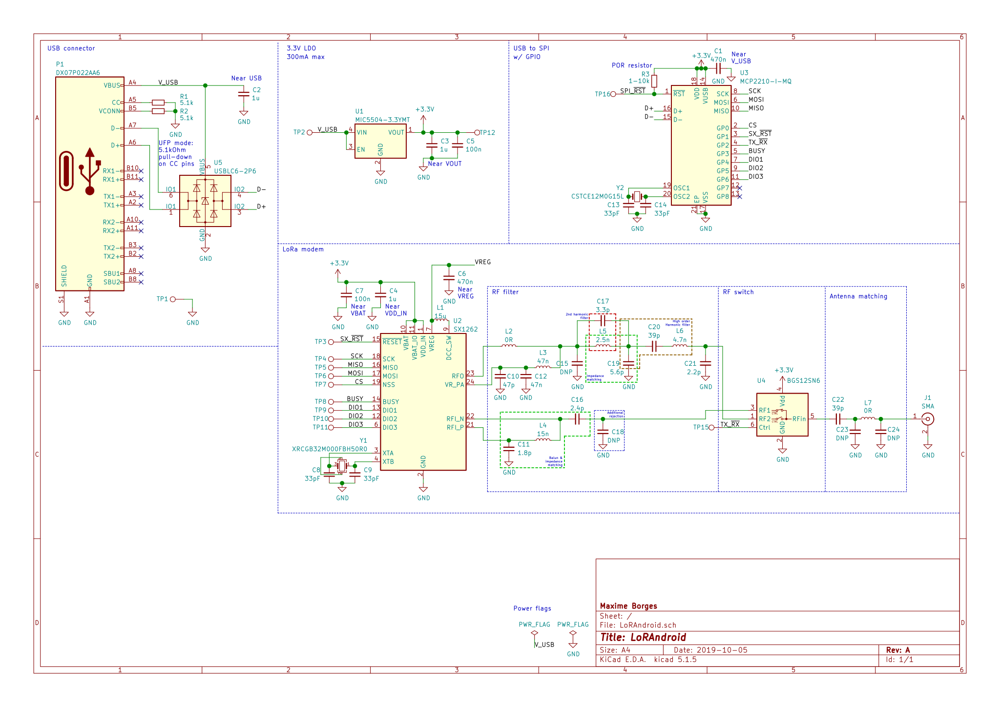

# LoRAndroid-hardware
Hardware source files for LoRAndroid project

## Get my symbols, footprints and 3D packages

Since not all my symbols, footprints and 3D package have been merged into the official repos yet, here are my forks that follows the `master` of each official repo (synces every hours using Github `Pull` app).

Symbols: https://github.com/maximeborges/kicad-symbols
Footprints: https://github.com/maximeborges/kicad-footprints
3D Packages: https://github.com/maximeborges/kicad-packages3D

You can add my repositories as remotes and check them out using the following comands: 

    cd kicad-symbols &&
    git remote add maximeborges git@github.com:maximeborges/kicad-symbols &&
    git checkout maximeborges/master -b maximeborges-master &&
    cd ..
    cd kicad-footprints &&
    git remote add maximeborges git@github.com:maximeborges/kicad-footprints &&
    git checkout maximeborges/master -b maximeborges-master &&
    cd ..
    cd kicad-packages3d &&
    git remote add maximeborges git@github.com:maximeborges/kicad-packages3d &&
    git checkout maximeborges/master -b maximeborges-master &&
    cd ..
    
To get back to the official repos and cleanup everything, you can use the following commands:

    cd kicad-symbols &&
    git branch -d maximeborges-master &&
    git remote rm maximeborges &&
    cd ..
    cd kicad-footprints &&
    git branch -d maximeborges-master &&
    git remote rm maximeborges &&
    cd ..
    cd kicad-packages3d &&
    git branch -d maximeborges-master &&
    git remote rm maximeborges &&
    cd ..
